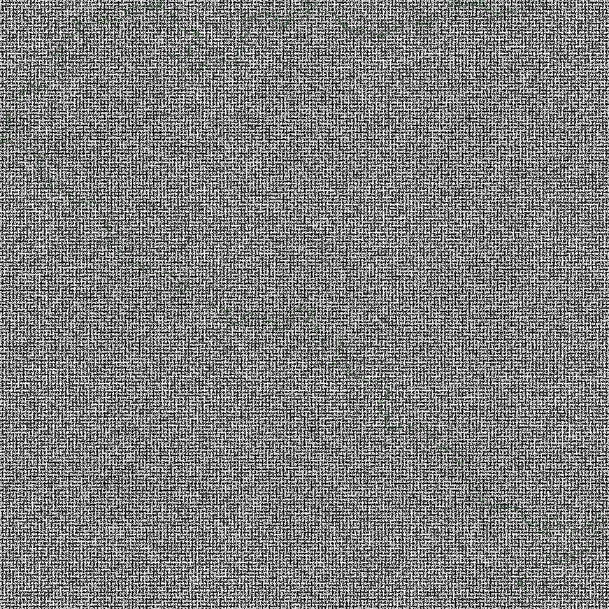

# MazeSolver

Java implementation of the Solving Maze algorithm presented by Computerphile.

## Usage

You can check out the releases page to download an executable Jar. You need [Java 8](https://adoptopenjdk.net) installed in order to run the jar.
With Java 8 installed you can run the jar file:

```shell script

$java -jar maze-solver-{version}.jar

```

The main idea is that there is maze represented by a binary image.
The image contains white pixels which represent free tiles and black pixels which represent impassable / blocked tiles.
There is a single free tile on the top row, which represents the starting point.
There is also a single free tile on the last row, which represents the destination / maze exit.
The goal is to find the shortest path from the starting point to the maze exit.

This project is inspired by the [maze solving algorithm from Computerphile](https://www.youtube.com/watch?v=rop0W4QDOUI).
There is a [dedicated repository](https://github.com/mikepound/mazesolving) for this. The original implementation is in Python.
I have also used the [same mazes](https://github.com/mikepound/mazesolving/tree/master/examples).

At this point in time, the only supported algorithm is Dijkstra.

**Dependencies**

The only dependency is [JUnit](https://junit.org/junit5/) ([Eclipse Public License](https://github.com/junit-team/junit5/blob/master/LICENSE.md)).

__NOTE:__ Be careful when using bigger mazes as it will use a lot of CPU and RAM.

A file chooser will be launched upon executing the jar file, either directly or via java -jar <jar-file>, prompting you to select one of the mazes.

Upon selecting the maze, the shortest path will be searched and after that a file will be written in the same directory as the original file 
with the name solved_\<original-file-name\>.

At the moment only PNG format is supported.

Some sample data:

- tiny.png

 

- small.png

 

- normal.png

 

Here is an example of a bigger one (4k x 4k pixels):


And an even bigger one (10k x 10k):


You can find multiple solved mazes in the docs directory.
