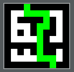
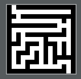
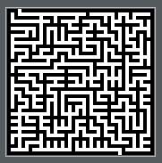
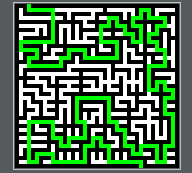

# MazeSolver

Java implementation of the Solving Maze algorithm presented by Computerphile.

This project is inspired by the [maze solving algorithm from Computerphile](https://www.youtube.com/watch?v=rop0W4QDOUI). It is a Dijkstra implementation.

**Dependecies**

- OpenImaj
- JUnit
- Mockito

__IMPORTANT NOTE:__ Be careful when using bigger mazes as it will use a lot of CPU and RAM.

Check out the mazes folder. The output file will be in the same folder as the input file.

Some sample data:

- tiny.png

 

- small.png

 

- normal.png

 

You can try your luck with the bigger mazes but be warned as it can eat a lot of memory and CPU.

Here is an example of a bigger one (it is a bit hard to show since it is 4k x 4k pixel):

