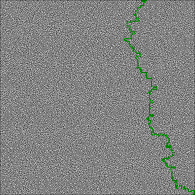
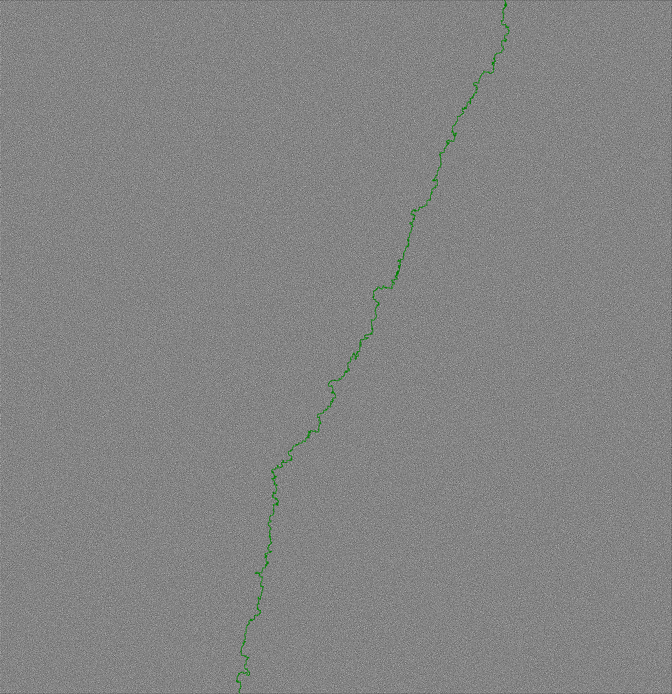
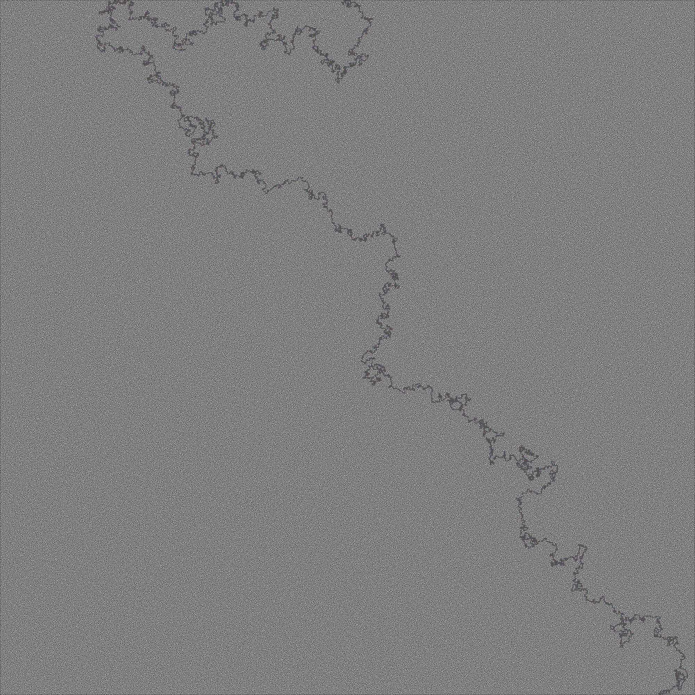

# Solved mazes

Here you can find a list of solved mazes. All mazes (up to and including the 6k x 6k) were solved using at most 4 GB of RAM.

The 10k x 10k maze used ~ 10 GB of RAM. In order to achieve this I used the -Xmx12g flag.

The default values for the JVM options can be viewed using the following command (including the MaxHeapSize):

```shell script

$java -XX:+PrintFlagsFinal -version

```

The solved mazes:

- tiny


- small


- normal


- braid200


- combo400



- braid2k



- perfect2k



- perfect4k


- combo6k


- perfect10k


